# microservice-solution

**微服务开发平台**

platform,以开发者为中心，打造企业快速开发平台,所有组件全部开源或基于开源软件二次开发
遵循开源软件协议的前提下，个人与企业可 100% 免费永久使用

## 组成本项目的主要组件

- 应用基础框架platform前端采用[vue-element-admin](https://github.com/PanJiaChen/vue-element-admin.git)二次开发而成,前后端分离支持Oauth2 Sso单点登录
前端定义好路由表从后端加载菜单与权限码实现动态路由与权限指令渲染前端元素
集成openapi-client-axios，支持根据openApi swagger文档生成axios客户端
前后端交互使用access_token认证模式，与后端微服务之间的认证token权限相同

- 应用基础框架platform后台,采用spring cloud,spring security Oauth2，作为无状态资源服务器与授权服务器分离
IAM资源管理权限管理接入MaxKey（每个注册应用都独立一套资源，角色可应用使用前提是分配跟目标应用访问权限），
权限控制路径权限过滤基于RBAC，支持spring security注解表达式
自定义权限注解分级鉴权，基于从授权服务器获取的资源权限码（缓存权限码基于loading cache或redis），采用AOP拦截Bean方法
前后端交互使用access_token认证模式，与后端微服务之间的认证token权限相同，意味着开发的接口可以同时提供给前端与其他微服务使用
集成openapi-generator-maven-plugin插件，支持根据其他服务提供的openApi swagger生产Feign Client，
当前请求上下文的access_token回放到下游微服务，前后端交互token过期根据refresh_token自动刷新续期

- 认证与授权中心服务采用开源软件[MaxKey](https://github.com/dromara/MaxKey.git)二次开发,扩展了部分接口
  MaxKey是业界领先的IAM身份管理和认证产品，国内开源IAM第一品牌
  统一认证和单点登录，简化账号登录过程，保护账号和密码安全，对账号进行统一管理。
  提供安全、标准和开放的用户身份管理(IDM)、身份认证(AM)、单点登录(SSO)(本项目采用标准Oauth2协议接入)、资源管理和权限管理(RBAC)等.
  标准安全策略包括密码策略，访问策略；事后安全审计，对用户全生命周期审计、访问行为记录追溯审计、安全合规审计、安全风险预警。

- 工作流微服务使用[Flowable](https://github.com/flowable/flowable-engine.git)二次开发，flowable是广泛使用的工作流引擎，其前身是Activiti，
支持动态表单、在线设计流程、会签 / 或签、多种任务分配方式
IAM用户角色(组)权限系统接入MaxKey(标准Oauth2协议),其开放的api权限也是基于access_token
每个应用(在MaxKey系统中注册，也是Oauth2 的clientId)都成为flowable都一个租户
每个租户的数据和流程逻辑分离

- 分布式消息总线采用自研组件[message-bus](https://github.com/travelersun/message-bus.git)，基于rabbitmq,zookeeper的消息总线,基于rest api异步收发消息
可以结合工作流微服务flowable使用，可在流程执行期间在分布式系统之间传递消息

应用架构图

消息路由结构

- 分布式调度中心计划采用[XXL-JOB](https://gitee.com/xuxueli0323/xxl-job.git)，其是一个轻量级分布式任务调度平台，其核心设计目标是开发迅速、学习简单、轻量级、易扩展。
主要改造要点是接入Oauth2协议，统一账号与权限，可结合flowable工作流微服务与分布式消息系统使用执行分布式作业

- 分布式序列中心计划采用[idCenter](https://github.com/zhongxunking/idcenter.git)，主要改造要点是接入Oauth2协议，统一账号与权限，
无特殊要求可以采用本地snowflake算法生产，特殊要求（如单调增，周期重置,连续，特定前缀）场景使用次分布式序列服务

工具类项目：
- [common-excel-parser](https://github.com/travelersun/common-excel-parser "common-excel-parser")
https://github.com/travelersun/common-excel-parser
Java 对象与excel映射的读写工具,可方便灵活操作excel表格,方便json或xml数据生成报表
- [query-filtering](https://github.com/travelersun/query-filtering "query-filtering")
https://github.com/travelersun/query-filtering
Json filter 语法 构建最终sql语句的表达式构建工具,结合mybatis可实现强大的查询功能

## 演示地址:
MaxKey登录前端
- http://106.55.129.98/maxkey/

MaxKey登录前台应用swagger地址
- http://106.55.129.98/sign/swagger-ui/index.html
- http://106.55.129.98/sign/v3/api-docs

MaxKey后台前端
- http://106.55.129.98/maxkey-mgt/

MaxKey登录后台台应用swagger地址
- http://106.55.129.98/maxkey-mgt-api/swagger-ui/index.html
- http://106.55.129.98/maxkey-mgt-api/v3/api-docs

flowable ui前端
- http://106.55.129.98/flowable/

flowable后台各个引擎api服务地址前缀
- http://106.55.129.98/flowable/processService
- http://106.55.129.98/flowable/cmmnService
- http://106.55.129.98/flowable/appService
- http://106.55.129.98/flowable/contentService
- http://106.55.129.98/flowable/dmnService
- http://106.55.129.98/flowable/formService
- http://106.55.129.98/flowable/idmService

flowable api文档地址
- http://106.55.129.98/flowable/docs/

应用基础框架前端
- http://106.55.129.98/platform

应用基础框架后端swagger地址
- http://106.55.129.98/platform-api/swagger-ui/index.html

## 功能截图

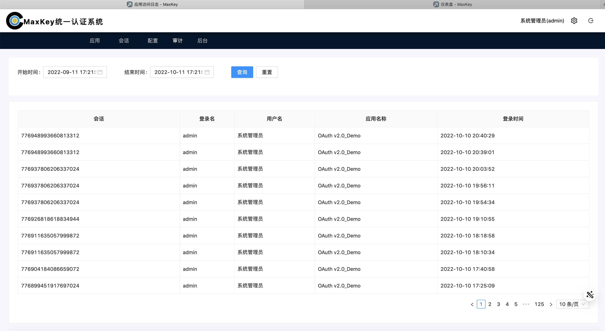

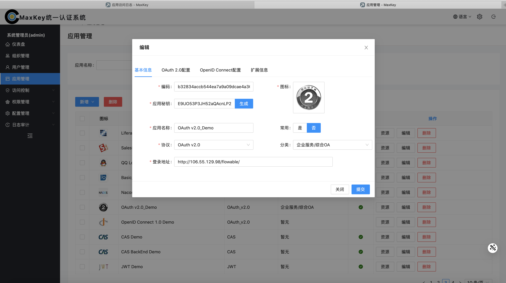

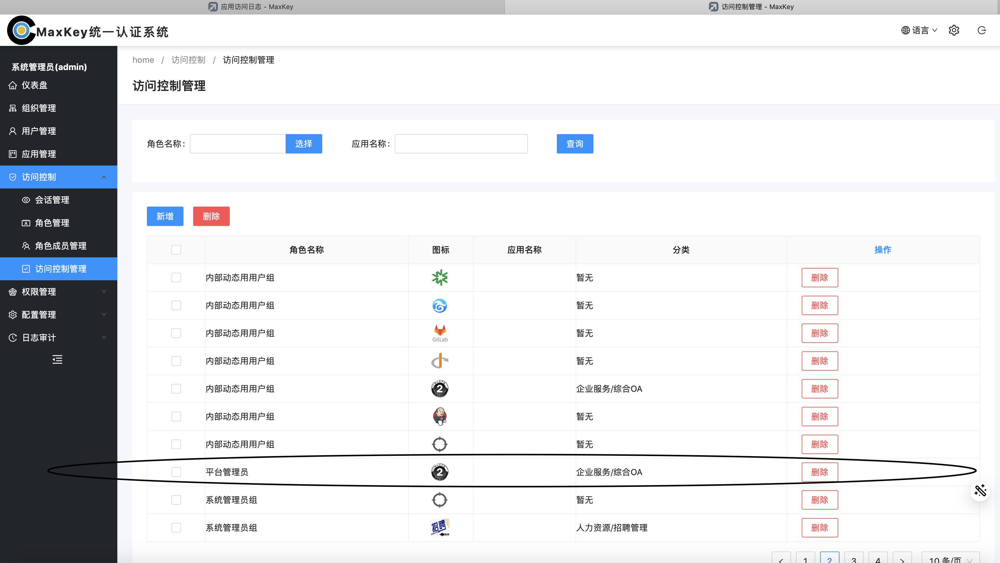

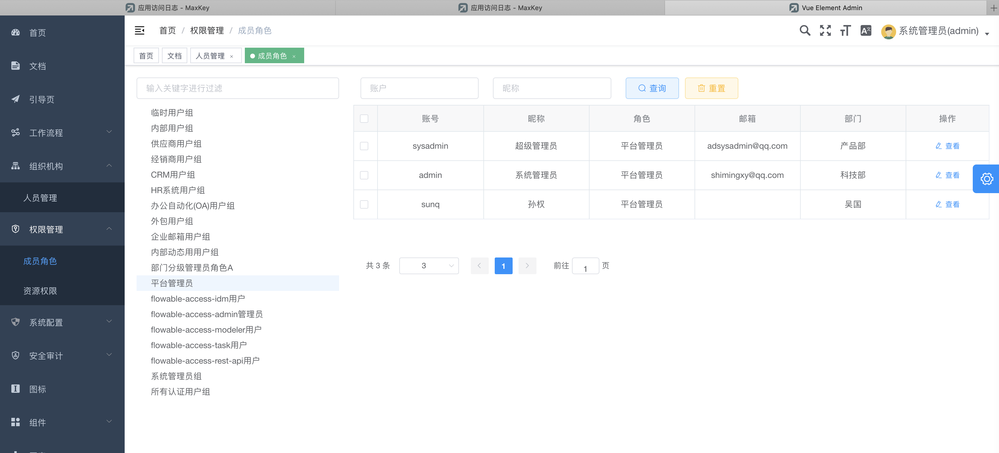
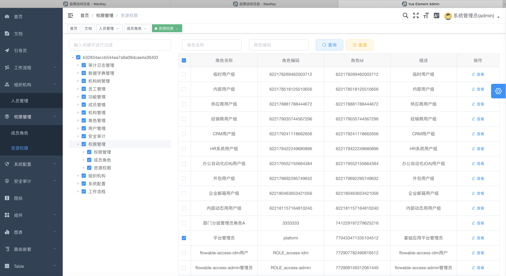

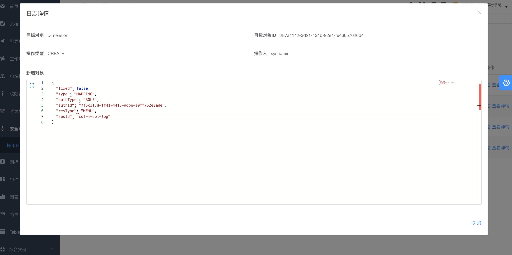
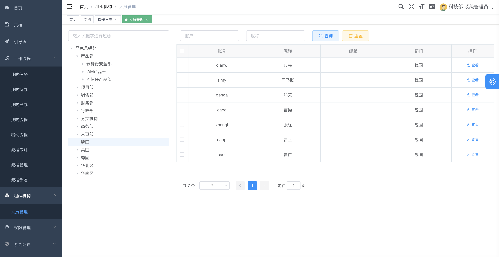

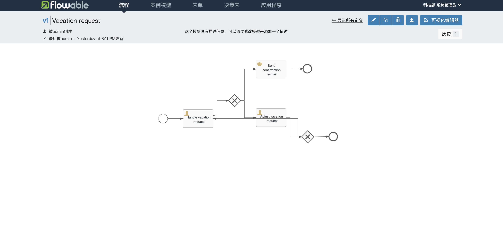
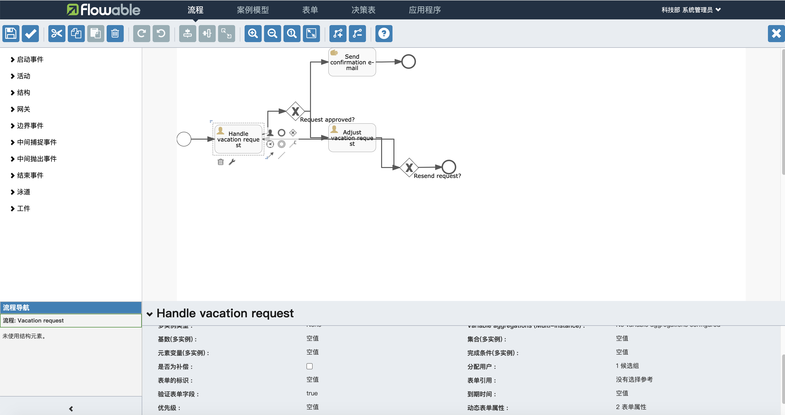

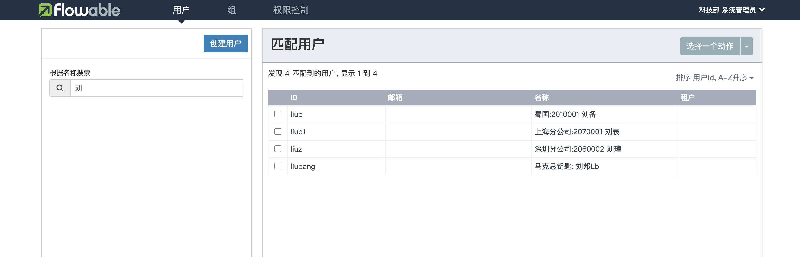

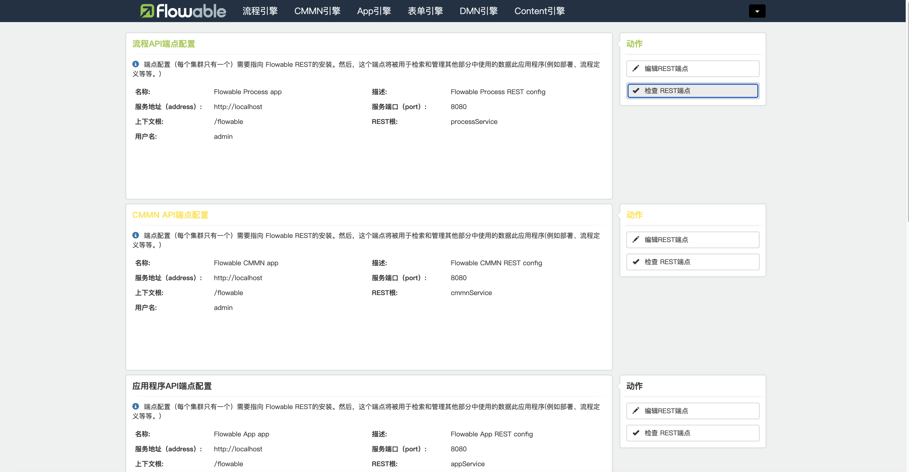
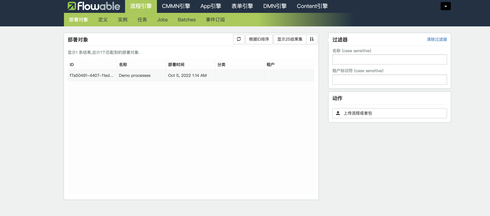
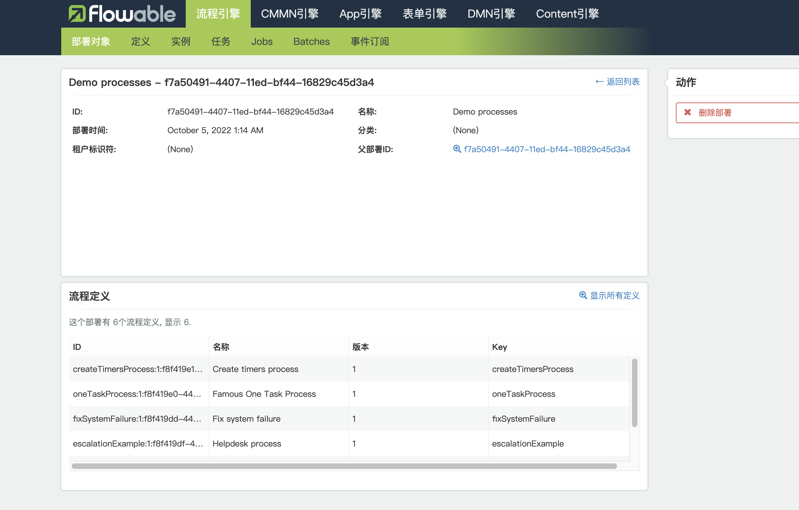

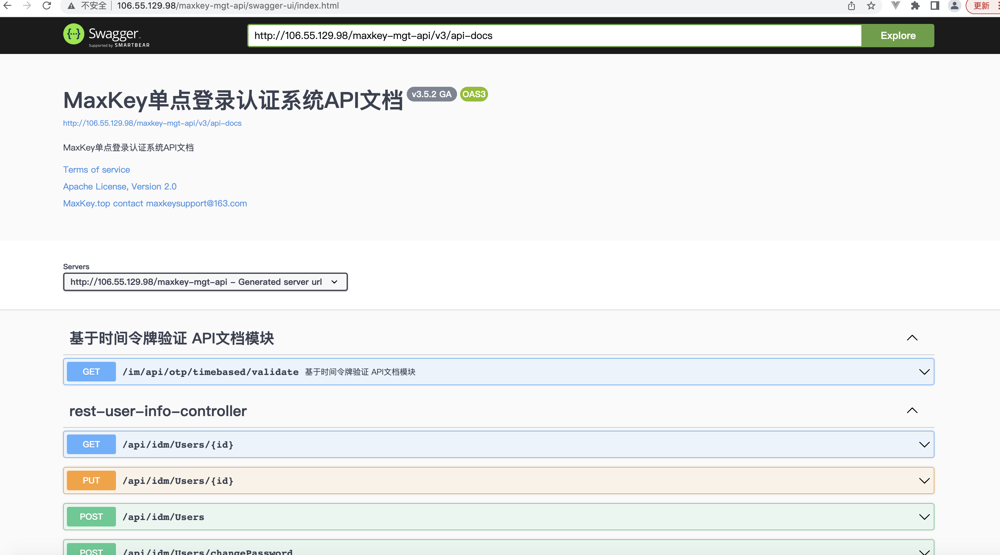
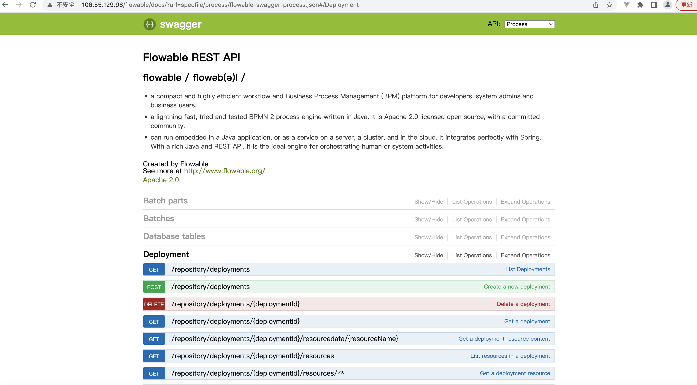

